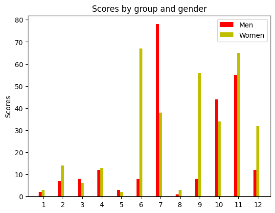

```python
import numpy as np
import matplotlib.pyplot as plt

```


```python

N = 12
medalists_mob = (2, 7, 8, 12, 3, 8, 78, 1, 8, 44, 55, 12)


```


```python
ind = np.arange(N)  # the x locations for the groups
width = 0.15       # the width of the bars


```


```python
fig, ax = plt.subplots()
rects1 = ax.bar(ind, medalists_mob, width, color='r')
participants_mob = (3, 14, 6, 13, 2, 67, 38, 3, 56, 34, 65, 32)
rects2 = ax.bar(ind + width, participants_mob, width, color='y')
# add some text for labels, title and axes ticks
ax.set_ylabel('Scores')
ax.set_title('Scores by group and gender')
ax.set_xticks(ind + width)
ax.set_xticklabels((1, 2, 3, 4, 5, 6, 7, 8, 9, 10, 11, 12))
ax.legend((rects1[0], rects2[0]), ('Men', 'Women'))
def autolabel(rects):
    # attach some text labels
    for rect in rects:
        height = rect.get_height()
        ax.text(rect.get_x() + rect.get_width()/2., 1.05*height,
                '%d' % int(height),
                ha='center', va='bottom')

#autolabel(rects1)
#autolabel(rects2)

plt.show()

```


    

    


```python

```


```python


```


```python

```


```python

```


```python

```


---
**Score: 5**
