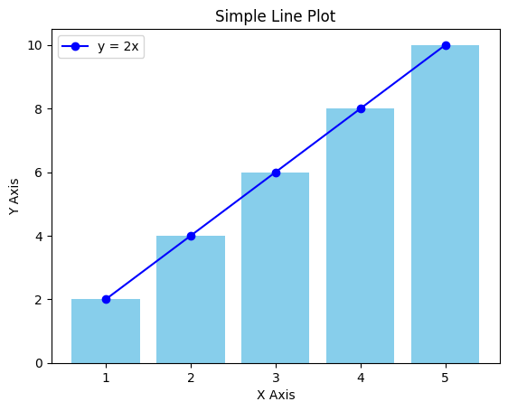

```python
import matplotlib.pyplot as plt
```


```python
# Data for plotting
x = [1, 2, 3, 4, 5]  # X-axis values
y = [2, 4, 6, 8, 10]  # Y-axis values

# Create a line plot
plt.plot(x, y, label='y = 2x', color='b', marker='o')
plt.bar(x, y, color='skyblue')

# Add titles and labels
plt.title('Simple Line Plot')
plt.xlabel('X Axis')
plt.ylabel('Y Axis')

# Display a legend
plt.legend()

# Show the plot
plt.show()

```


    

    


```python

```


---
**Score: 0**
