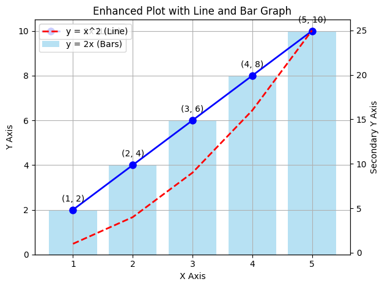

```python
import matplotlib.pyplot as plt
```


```python
import matplotlib.pyplot as plt
```


```python
# Data for plotting
x = [1, 2, 3, 4, 5]  # X-axis values
y = [2, 4, 6, 8, 10]  # Y-axis values
```


```python

```


```python
# Create a figure and axis
fig, ax1 = plt.subplots()


# Create a line plot with customizations
ax1.plot(x, y, label='y = 2x (Line)', color='b', marker='o', linestyle='-', linewidth=2, markersize=8)

# Add a bar plot on the same axis
ax1.bar(x, y, color='skyblue', alpha=0.6, label='y = 2x (Bars)')
# Set titles and labels
ax1.set_title('Enhanced Plot with Line and Bar Graph')
ax1.set_xlabel('X Axis')
ax1.set_ylabel('Y Axis')

# Add gridlines for better readability
ax1.grid(True)

# Display a legend
ax1.legend()

# Add annotations for specific data points
for i in range(len(x)):
    ax1.annotate(f'({x[i]}, {y[i]})', (x[i], y[i]), textcoords="offset points", xytext=(0, 10), ha='center')

# Optionally, add a secondary Y-axis with a different scale (for illustration)
ax2 = ax1.twinx()
ax2.set_ylabel('Secondary Y Axis')
ax2.plot(x, [i**2 for i in x], color='r', linestyle='--', label='y = x^2 (Line)', linewidth=2)
ax2.legend(loc='upper left')


# Display the plot
plt.tight_layout()  # Adjust layout to prevent overlap
plt.show()
```


    

    


```python


```


```python


```


```python

```


```python

```


```python

```


```python

```


---
**Score: 10**
