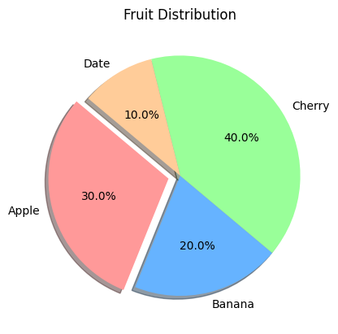
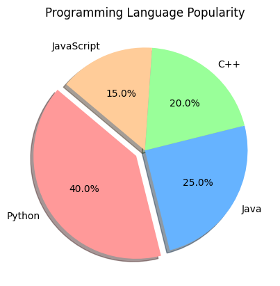

```python
import matplotlib.pyplot as plt

```


```python
# Data for plotting
labels = ['Apple', 'Banana', 'Cherry', 'Date']
sizes = [30, 20, 40, 10]  # The percentage share of each category
colors = ['#ff9999','#66b3ff','#99ff99','#ffcc99']  # Custom colors for each slice
explode = (0.1, 0, 0, 0)  # "Explode" the first slice (Apple) slightly

# Create a pie chart
plt.pie(sizes, labels=labels, colors=colors, explode=explode, autopct='%1.1f%%', shadow=True, startangle=140)

# Add a title
plt.title('Fruit Distribution')

# Display the pie chart
plt.show()
```


    

    


```python
import matplotlib.pyplot as plt


```


```python
# Data for plotting
labels = ['Python', 'Java', 'C++', 'JavaScript']
sizes = [40, 25, 20, 15]
colors = ['#ff9999', '#66b3ff', '#99ff99', '#ffcc99']
explode = (0.1, 0, 0, 0)  # "Explode" the Python slice slightly

# Create a pie chart
plt.pie(sizes, labels=labels, colors=colors, explode=explode, autopct='%1.1f%%', shadow=True, startangle=140)

# Add a title
plt.title('Programming Language Popularity')

# Display the pie chart
plt.show()
```


    

    


```python

```


---
**Score: 5**
