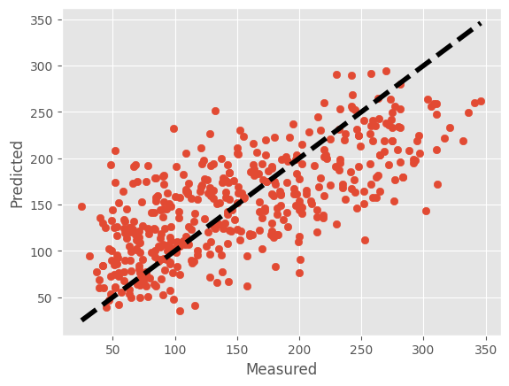

```python

```


```python
import numpy as np
import matplotlib.pyplot as plt
from sklearn import linear_model
from sklearn.model_selection import cross_val_predict
from sklearn.datasets import load_diabetes
```


```python
# Load an example dataset (replace this with your own data)
data = load_diabetes()
X = data.data  # Features
y = data.target  # Target
```


```python
# Initialize the linear regression model
lr = linear_model.LinearRegression()
```


```python
# Cross-validation prediction
predicted = cross_val_predict(lr, X, y, cv=10)
```


```python
# Plotting
fig, ax = plt.subplots()
ax.scatter(y, predicted)
ax.plot([y.min(), y.max()], [y.min(), y.max()], 'k--', lw=4)
ax.set_xlabel('Measured')
ax.set_ylabel('Predicted')
plt.show()
```


    

    


```python

```


---
**Score: 5**
