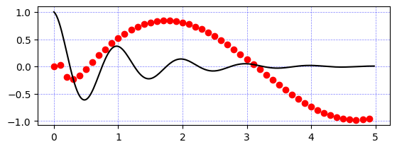

```python
import numpy as np
import matplotlib.pyplot as plt
def f(t):
    return np.exp(-t) * np.cos(2*np.pi*t)
def g(t):
    return np.sin(t) * np.cos(1/(t+0.1))
t1 = np.arange(0.0, 5.0, 0.1)
t2 = np.arange(0.0, 5.0, 0.02)
plt.subplot(212)
plt.plot(t1, g(t1), 'ro', t2, f(t2), 'k')
plt.grid(color='b', alpha=0.5, linestyle='dashed', linewidth=0.5)
plt.show()
```


    

    


```python
import numpy as np
import matplotlib.pyplot as plt
def f(t):
    return np.exp(-t) * np.cos(2*np.pi*t)
def g(t):
    return np.sin(t) * np.cos(1/(t+0.1))
t1 = np.arange(0.0, 5.0, 0.1)
t2 = np.arange(0.0, 5.0, 0.02)
plt.subplot(312)
plt.plot(t1, g(t1), 'ro', t2, f(t2), 'k')
plt.grid(color='c', alpha=0.5, linestyle='dashed', linewidth=1)
plt.show()
```


    

    


```python

```


```python

```


---
**Score: 0**
