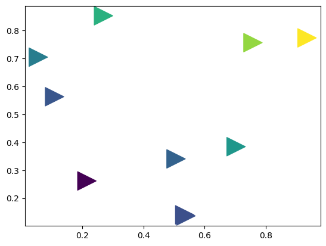

```python
import numpy as np
import matplotlib.pyplot as plt
```


```python

x = np.random.rand(10)
y = np.random.rand(10)
z = np.sqrt(x**2 + y**2)

```


```python
plt.subplot(111)
plt.scatter(x, y, s=500, c=z, marker=">")


'''
plt.subplot(322)
plt.scatter(x, y, s=80, c=z, marker=(5, 0))

verts = list(zip([-1., 1., 1., -1.], [-1., -1., 1., -1.]))
plt.subplot(323)
plt.scatter(x, y, s=80, c=z, marker=(verts, 0))
# equivalent:
#plt.scatter(x,y,s=80, c=z, marker=None, verts=verts)

plt.subplot(324)
plt.scatter(x, y, s=80, c=z, marker=(5, 1))

plt.subplot(325)
plt.scatter(x, y, s=80, c=z, marker='+')

plt.subplot(326)
plt.scatter(x, y, s=80, c=z, marker=(5, 2))
'''

plt.show()


```


    

    


```python

```


```python

```


```python

```


---
**Score: 5**
