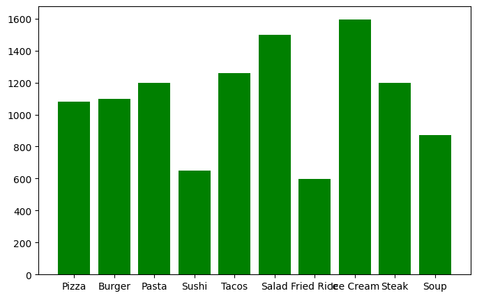

```python
#Load the food_sales.csv data into another DataFrame.
```


```python
import pandas as pd
```


```python
FILEPATH = 'food.csv'
```


```python
food = pd.read_csv(FILEPATH)
```


```python
food
```


<div>
<style scoped>
    .dataframe tbody tr th:only-of-type {
        vertical-align: middle;
    }

    .dataframe tbody tr th {
        vertical-align: top;
    }

    .dataframe thead th {
        text-align: right;
    }
</style>
<table border="1" class="dataframe">
  <thead>
    <tr style="text-align: right;">
      <th></th>
      <th>Food_ID</th>
      <th>Food_Name</th>
      <th>Category</th>
      <th>Price</th>
      <th>Calories</th>
      <th>Available</th>
    </tr>
  </thead>
  <tbody>
    <tr>
      <th>0</th>
      <td>1</td>
      <td>Pizza</td>
      <td>Fast Food</td>
      <td>8.99</td>
      <td>300</td>
      <td>Yes</td>
    </tr>
    <tr>
      <th>1</th>
      <td>2</td>
      <td>Burger</td>
      <td>Fast Food</td>
      <td>5.49</td>
      <td>450</td>
      <td>Yes</td>
    </tr>
    <tr>
      <th>2</th>
      <td>3</td>
      <td>Pasta</td>
      <td>Italian</td>
      <td>7.99</td>
      <td>400</td>
      <td>No</td>
    </tr>
    <tr>
      <th>3</th>
      <td>4</td>
      <td>Sushi</td>
      <td>Japanese</td>
      <td>12.99</td>
      <td>250</td>
      <td>Yes</td>
    </tr>
    <tr>
      <th>4</th>
      <td>5</td>
      <td>Tacos</td>
      <td>Mexican</td>
      <td>6.99</td>
      <td>200</td>
      <td>No</td>
    </tr>
    <tr>
      <th>5</th>
      <td>6</td>
      <td>Salad</td>
      <td>Healthy</td>
      <td>4.99</td>
      <td>150</td>
      <td>Yes</td>
    </tr>
    <tr>
      <th>6</th>
      <td>7</td>
      <td>Fried Rice</td>
      <td>Asian</td>
      <td>5.99</td>
      <td>350</td>
      <td>Yes</td>
    </tr>
    <tr>
      <th>7</th>
      <td>8</td>
      <td>Ice Cream</td>
      <td>Dessert</td>
      <td>3.99</td>
      <td>200</td>
      <td>Yes</td>
    </tr>
    <tr>
      <th>8</th>
      <td>9</td>
      <td>Steak</td>
      <td>Grill</td>
      <td>14.99</td>
      <td>700</td>
      <td>No</td>
    </tr>
    <tr>
      <th>9</th>
      <td>10</td>
      <td>Soup</td>
      <td>Healthy</td>
      <td>3.49</td>
      <td>100</td>
      <td>Yes</td>
    </tr>
  </tbody>
</table>
</div>


```python
food_sales = pd.read_csv('food_sales.csv')
```


```python
food_sales
```


<div>
<style scoped>
    .dataframe tbody tr th:only-of-type {
        vertical-align: middle;
    }

    .dataframe tbody tr th {
        vertical-align: top;
    }

    .dataframe thead th {
        text-align: right;
    }
</style>
<table border="1" class="dataframe">
  <thead>
    <tr style="text-align: right;">
      <th></th>
      <th>Food_Name</th>
      <th>Units_Sold</th>
    </tr>
  </thead>
  <tbody>
    <tr>
      <th>0</th>
      <td>Pizza</td>
      <td>120</td>
    </tr>
    <tr>
      <th>1</th>
      <td>Burger</td>
      <td>200</td>
    </tr>
    <tr>
      <th>2</th>
      <td>Pasta</td>
      <td>150</td>
    </tr>
    <tr>
      <th>3</th>
      <td>Sushi</td>
      <td>50</td>
    </tr>
    <tr>
      <th>4</th>
      <td>Tacos</td>
      <td>180</td>
    </tr>
    <tr>
      <th>5</th>
      <td>Salad</td>
      <td>300</td>
    </tr>
    <tr>
      <th>6</th>
      <td>Fried Rice</td>
      <td>100</td>
    </tr>
    <tr>
      <th>7</th>
      <td>Ice Cream</td>
      <td>400</td>
    </tr>
    <tr>
      <th>8</th>
      <td>Steak</td>
      <td>80</td>
    </tr>
    <tr>
      <th>9</th>
      <td>Soup</td>
      <td>250</td>
    </tr>
  </tbody>
</table>
</div>


```python
df = pd.merge(food, food_sales, on ='Food_Name')
```


```python
df
```


<div>
<style scoped>
    .dataframe tbody tr th:only-of-type {
        vertical-align: middle;
    }

    .dataframe tbody tr th {
        vertical-align: top;
    }

    .dataframe thead th {
        text-align: right;
    }
</style>
<table border="1" class="dataframe">
  <thead>
    <tr style="text-align: right;">
      <th></th>
      <th>Food_ID</th>
      <th>Food_Name</th>
      <th>Category</th>
      <th>Price</th>
      <th>Calories</th>
      <th>Available</th>
      <th>Units_Sold</th>
    </tr>
  </thead>
  <tbody>
    <tr>
      <th>0</th>
      <td>1</td>
      <td>Pizza</td>
      <td>Fast Food</td>
      <td>8.99</td>
      <td>300</td>
      <td>Yes</td>
      <td>120</td>
    </tr>
    <tr>
      <th>1</th>
      <td>2</td>
      <td>Burger</td>
      <td>Fast Food</td>
      <td>5.49</td>
      <td>450</td>
      <td>Yes</td>
      <td>200</td>
    </tr>
    <tr>
      <th>2</th>
      <td>3</td>
      <td>Pasta</td>
      <td>Italian</td>
      <td>7.99</td>
      <td>400</td>
      <td>No</td>
      <td>150</td>
    </tr>
    <tr>
      <th>3</th>
      <td>4</td>
      <td>Sushi</td>
      <td>Japanese</td>
      <td>12.99</td>
      <td>250</td>
      <td>Yes</td>
      <td>50</td>
    </tr>
    <tr>
      <th>4</th>
      <td>5</td>
      <td>Tacos</td>
      <td>Mexican</td>
      <td>6.99</td>
      <td>200</td>
      <td>No</td>
      <td>180</td>
    </tr>
    <tr>
      <th>5</th>
      <td>6</td>
      <td>Salad</td>
      <td>Healthy</td>
      <td>4.99</td>
      <td>150</td>
      <td>Yes</td>
      <td>300</td>
    </tr>
    <tr>
      <th>6</th>
      <td>7</td>
      <td>Fried Rice</td>
      <td>Asian</td>
      <td>5.99</td>
      <td>350</td>
      <td>Yes</td>
      <td>100</td>
    </tr>
    <tr>
      <th>7</th>
      <td>8</td>
      <td>Ice Cream</td>
      <td>Dessert</td>
      <td>3.99</td>
      <td>200</td>
      <td>Yes</td>
      <td>400</td>
    </tr>
    <tr>
      <th>8</th>
      <td>9</td>
      <td>Steak</td>
      <td>Grill</td>
      <td>14.99</td>
      <td>700</td>
      <td>No</td>
      <td>80</td>
    </tr>
    <tr>
      <th>9</th>
      <td>10</td>
      <td>Soup</td>
      <td>Healthy</td>
      <td>3.49</td>
      <td>100</td>
      <td>Yes</td>
      <td>250</td>
    </tr>
  </tbody>
</table>
</div>


```python
#Calculate the total revenue for each food item (Price * Units_Sold) and add it as a new column.
```


```python
df.head()
```


<div>
<style scoped>
    .dataframe tbody tr th:only-of-type {
        vertical-align: middle;
    }

    .dataframe tbody tr th {
        vertical-align: top;
    }

    .dataframe thead th {
        text-align: right;
    }
</style>
<table border="1" class="dataframe">
  <thead>
    <tr style="text-align: right;">
      <th></th>
      <th>Food_ID</th>
      <th>Food_Name</th>
      <th>Category</th>
      <th>Price</th>
      <th>Calories</th>
      <th>Available</th>
      <th>Units_Sold</th>
    </tr>
  </thead>
  <tbody>
    <tr>
      <th>0</th>
      <td>1</td>
      <td>Pizza</td>
      <td>Fast Food</td>
      <td>8.99</td>
      <td>300</td>
      <td>Yes</td>
      <td>120</td>
    </tr>
    <tr>
      <th>1</th>
      <td>2</td>
      <td>Burger</td>
      <td>Fast Food</td>
      <td>5.49</td>
      <td>450</td>
      <td>Yes</td>
      <td>200</td>
    </tr>
    <tr>
      <th>2</th>
      <td>3</td>
      <td>Pasta</td>
      <td>Italian</td>
      <td>7.99</td>
      <td>400</td>
      <td>No</td>
      <td>150</td>
    </tr>
    <tr>
      <th>3</th>
      <td>4</td>
      <td>Sushi</td>
      <td>Japanese</td>
      <td>12.99</td>
      <td>250</td>
      <td>Yes</td>
      <td>50</td>
    </tr>
    <tr>
      <th>4</th>
      <td>5</td>
      <td>Tacos</td>
      <td>Mexican</td>
      <td>6.99</td>
      <td>200</td>
      <td>No</td>
      <td>180</td>
    </tr>
  </tbody>
</table>
</div>


```python
df['Total_Revenue'] = df['Price'] * df['Units_Sold']
```


```python
df['Total_Revenue']
```


    0    1078.8
    1    1098.0
    2    1198.5
    3     649.5
    4    1258.2
    5    1497.0
    6     599.0
    7    1596.0
    8    1199.2
    9     872.5
    Name: Total_Revenue, dtype: float64


```python
df
```


<div>
<style scoped>
    .dataframe tbody tr th:only-of-type {
        vertical-align: middle;
    }

    .dataframe tbody tr th {
        vertical-align: top;
    }

    .dataframe thead th {
        text-align: right;
    }
</style>
<table border="1" class="dataframe">
  <thead>
    <tr style="text-align: right;">
      <th></th>
      <th>Food_ID</th>
      <th>Food_Name</th>
      <th>Category</th>
      <th>Price</th>
      <th>Calories</th>
      <th>Available</th>
      <th>Units_Sold</th>
      <th>Total</th>
      <th>Total_Revenue</th>
    </tr>
  </thead>
  <tbody>
    <tr>
      <th>0</th>
      <td>1</td>
      <td>Pizza</td>
      <td>Fast Food</td>
      <td>8.99</td>
      <td>300</td>
      <td>Yes</td>
      <td>120</td>
      <td>1078.8</td>
      <td>1078.8</td>
    </tr>
    <tr>
      <th>1</th>
      <td>2</td>
      <td>Burger</td>
      <td>Fast Food</td>
      <td>5.49</td>
      <td>450</td>
      <td>Yes</td>
      <td>200</td>
      <td>1098.0</td>
      <td>1098.0</td>
    </tr>
    <tr>
      <th>2</th>
      <td>3</td>
      <td>Pasta</td>
      <td>Italian</td>
      <td>7.99</td>
      <td>400</td>
      <td>No</td>
      <td>150</td>
      <td>1198.5</td>
      <td>1198.5</td>
    </tr>
    <tr>
      <th>3</th>
      <td>4</td>
      <td>Sushi</td>
      <td>Japanese</td>
      <td>12.99</td>
      <td>250</td>
      <td>Yes</td>
      <td>50</td>
      <td>649.5</td>
      <td>649.5</td>
    </tr>
    <tr>
      <th>4</th>
      <td>5</td>
      <td>Tacos</td>
      <td>Mexican</td>
      <td>6.99</td>
      <td>200</td>
      <td>No</td>
      <td>180</td>
      <td>1258.2</td>
      <td>1258.2</td>
    </tr>
    <tr>
      <th>5</th>
      <td>6</td>
      <td>Salad</td>
      <td>Healthy</td>
      <td>4.99</td>
      <td>150</td>
      <td>Yes</td>
      <td>300</td>
      <td>1497.0</td>
      <td>1497.0</td>
    </tr>
    <tr>
      <th>6</th>
      <td>7</td>
      <td>Fried Rice</td>
      <td>Asian</td>
      <td>5.99</td>
      <td>350</td>
      <td>Yes</td>
      <td>100</td>
      <td>599.0</td>
      <td>599.0</td>
    </tr>
    <tr>
      <th>7</th>
      <td>8</td>
      <td>Ice Cream</td>
      <td>Dessert</td>
      <td>3.99</td>
      <td>200</td>
      <td>Yes</td>
      <td>400</td>
      <td>1596.0</td>
      <td>1596.0</td>
    </tr>
    <tr>
      <th>8</th>
      <td>9</td>
      <td>Steak</td>
      <td>Grill</td>
      <td>14.99</td>
      <td>700</td>
      <td>No</td>
      <td>80</td>
      <td>1199.2</td>
      <td>1199.2</td>
    </tr>
    <tr>
      <th>9</th>
      <td>10</td>
      <td>Soup</td>
      <td>Healthy</td>
      <td>3.49</td>
      <td>100</td>
      <td>Yes</td>
      <td>250</td>
      <td>872.5</td>
      <td>872.5</td>
    </tr>
  </tbody>
</table>
</div>


```python
import matplotlib.pyplot as plt
```


```python
plt.figure(figsize =(8,5))
plt.bar(df['Food_Name'],df['Total_Revenue'],color = 'green')
```


    <BarContainer object of 10 artists>


    

    


```python

```


---
**Score: 15**
