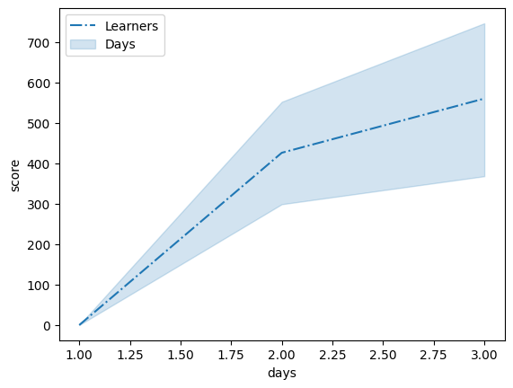
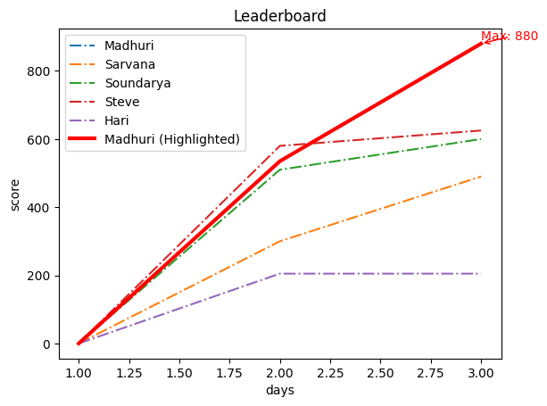
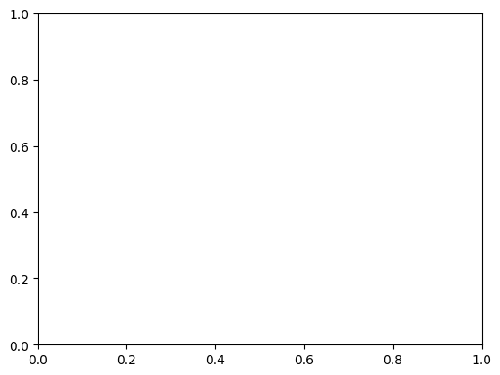

```python
import pandas as pd
import seaborn as sns
import matplotlib.pyplot as plt
```


```python
days_list = [
    1, 1, 1, 1, 1,
    2, 2, 2, 2, 2,
    3, 3, 3, 3, 3
]
```


```python
len(days_list)
```


    15


```python
learners_list = [
    'Madhuri','Sarvana','Soundarya','Steve','Hari',
    'Madhuri','Sarvana','Soundarya','Steve','Hari',
    'Madhuri','Sarvana','Soundarya','Steve','Hari'
]
```


```python
len(learners_list)
```


    15


```python
score_list = [
    0, 0, 0, 0, 0,
    535,300,510,580,205,
    880,490,600,625,205
]
    
```


```python
len(score_list)
```


    15


```python
data = {
    'days':  days_list,
    'learners': learners_list,
    'score' : score_list
}
```


```python
df = pd.DataFrame(data)
```


```python
df
```


<div>
<style scoped>
    .dataframe tbody tr th:only-of-type {
        vertical-align: middle;
    }

    .dataframe tbody tr th {
        vertical-align: top;
    }

    .dataframe thead th {
        text-align: right;
    }
</style>
<table border="1" class="dataframe">
  <thead>
    <tr style="text-align: right;">
      <th></th>
      <th>days</th>
      <th>learners</th>
      <th>score</th>
    </tr>
  </thead>
  <tbody>
    <tr>
      <th>0</th>
      <td>1</td>
      <td>Madhuri</td>
      <td>0</td>
    </tr>
    <tr>
      <th>1</th>
      <td>1</td>
      <td>Sarvana</td>
      <td>0</td>
    </tr>
    <tr>
      <th>2</th>
      <td>1</td>
      <td>Soundarya</td>
      <td>0</td>
    </tr>
    <tr>
      <th>3</th>
      <td>1</td>
      <td>Steve</td>
      <td>0</td>
    </tr>
    <tr>
      <th>4</th>
      <td>1</td>
      <td>Hari</td>
      <td>0</td>
    </tr>
    <tr>
      <th>5</th>
      <td>2</td>
      <td>Madhuri</td>
      <td>535</td>
    </tr>
    <tr>
      <th>6</th>
      <td>2</td>
      <td>Sarvana</td>
      <td>300</td>
    </tr>
    <tr>
      <th>7</th>
      <td>2</td>
      <td>Soundarya</td>
      <td>510</td>
    </tr>
    <tr>
      <th>8</th>
      <td>2</td>
      <td>Steve</td>
      <td>580</td>
    </tr>
    <tr>
      <th>9</th>
      <td>2</td>
      <td>Hari</td>
      <td>205</td>
    </tr>
    <tr>
      <th>10</th>
      <td>3</td>
      <td>Madhuri</td>
      <td>880</td>
    </tr>
    <tr>
      <th>11</th>
      <td>3</td>
      <td>Sarvana</td>
      <td>490</td>
    </tr>
    <tr>
      <th>12</th>
      <td>3</td>
      <td>Soundarya</td>
      <td>600</td>
    </tr>
    <tr>
      <th>13</th>
      <td>3</td>
      <td>Steve</td>
      <td>625</td>
    </tr>
    <tr>
      <th>14</th>
      <td>3</td>
      <td>Hari</td>
      <td>205</td>
    </tr>
  </tbody>
</table>
</div>


```python
df_wide = pd.DataFrame(data)
```


```python
df_wide = df.pivot(index ='days', columns = 'learners', values = 'score')
```


```python
df_wide
```


<div>
<style scoped>
    .dataframe tbody tr th:only-of-type {
        vertical-align: middle;
    }

    .dataframe tbody tr th {
        vertical-align: top;
    }

    .dataframe thead th {
        text-align: right;
    }
</style>
<table border="1" class="dataframe">
  <thead>
    <tr style="text-align: right;">
      <th>learners</th>
      <th>Hari</th>
      <th>Madhuri</th>
      <th>Sarvana</th>
      <th>Soundarya</th>
      <th>Steve</th>
    </tr>
    <tr>
      <th>days</th>
      <th></th>
      <th></th>
      <th></th>
      <th></th>
      <th></th>
    </tr>
  </thead>
  <tbody>
    <tr>
      <th>1</th>
      <td>0</td>
      <td>0</td>
      <td>0</td>
      <td>0</td>
      <td>0</td>
    </tr>
    <tr>
      <th>2</th>
      <td>205</td>
      <td>535</td>
      <td>300</td>
      <td>510</td>
      <td>580</td>
    </tr>
    <tr>
      <th>3</th>
      <td>205</td>
      <td>880</td>
      <td>490</td>
      <td>600</td>
      <td>625</td>
    </tr>
  </tbody>
</table>
</div>


```python
df_wide = pd.DataFrame(data)
```


```python

```


```python
import seaborn as sns
```


```python
#!pip install seaborn
```


```python
sns.lineplot(data = df_wide, x="days", y="score",linestyle = "-.")
plt.legend(labels = ['Learners','Days','Score'])

```


    <matplotlib.legend.Legend at 0x13a95d910>


    

    


```python
ax = sns.lineplot(data=df_wide, x="days", y="score",hue="learners",linestyle="-.").set(title = "Leaderboard")
highlight_learner = 'Madhuri'
highlight_data = df_wide[df_wide['learners'] == highlight_learner]
sns.lineplot(
    data=highlight_data, x="days", y="score", color="red", linewidth=3, label=f"{highlight_learner} (Highlighted)"
)
highlight_learner = 'Madhuri'
highlight_data = df_wide[df_wide['learners'] == highlight_learner]
max_score = highlight_data['score'].max()
max_day = highlight_data[highlight_data['score'] == max_score]['days'].values[0]
plt.annotate(f"Max: {max_score}", xy=(max_day, max_score), xytext=(max_day-0, max_score+10),
             arrowprops=dict(arrowstyle="->", color="red"), color="red")

```


    Text(3, 890, 'Max: 880')


    

    


```python

```


```python

```


```python

```


    Text(2.8, 890, 'Max: 880')


    

    


```python

```


```python

```


---
**Score: 20**
