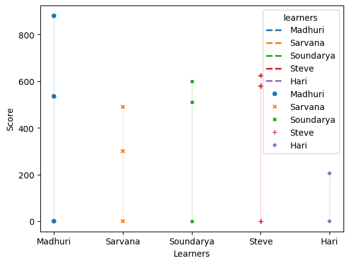

```python
import pandas as pd
import matplotlib.pyplot as plt
import seaborn as sns
```


```python
days_list = [
    1, 1, 1, 1, 1,
    2, 2, 2, 2, 2,
    3, 3, 3, 3, 3
]
```


```python
learners_list = [
    'Madhuri','Sarvana','Soundarya','Steve','Hari',
    'Madhuri','Sarvana','Soundarya','Steve','Hari',
    'Madhuri','Sarvana','Soundarya','Steve','Hari'
]
```


```python
score_list = [
    0, 0, 0, 0, 0,
    535,300,510,580,205,
    880,490,600,625,205
]
```


```python
data = {
    'days':  days_list,
    'learners': learners_list,
    'score' : score_list
}
```


```python
df = pd.DataFrame(data)
```


```python
df_wide = df.pivot(index ='days', columns = 'learners', values = 'score')
```


```python
df_wide = pd.DataFrame(data)
```


```python
sns.lineplot(data = df_wide, x = "learners", y = "score",hue="learners", linestyle="dashed", linewidth=2,)
sns.scatterplot(data = df_wide, x = "learners", y = "score",hue="learners",style="learners")
plt.xlabel("Learners")
plt.ylabel("Score")
plt.show()
```


    

    


```python

```


---
**Score: 10**
