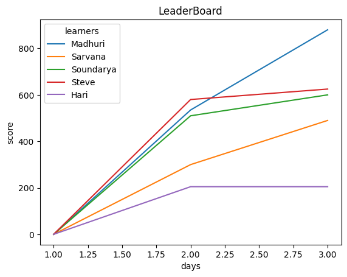

```python
import pandas as pd
import matplotlib.pyplot as plt
```


```python
days_list = [
    1, 1, 1, 1, 1,
    2, 2, 2, 2, 2,
    3, 3, 3, 3, 3
]
```


```python
len(days_list)
```


    15


```python
learners_list = [
    'Madhuri','Sarvana','Soundarya','Steve','Hari',
    'Madhuri','Sarvana','Soundarya','Steve','Hari',
    'Madhuri','Sarvana','Soundarya','Steve','Hari'
]
```


```python
len(learners_list)
```


    15


```python
score_list = [
    0, 0, 0, 0, 0,
    535,300,510,580,205,
    880,490,600,625,205
]
    
```


```python
len(score_list)
```


    15


```python
data = {
    'days':  days_list,
    'learners': learners_list,
    'score' : score_list
}
```


```python
df = pd.DataFrame(data)
```


```python
df
```


<div>
<style scoped>
    .dataframe tbody tr th:only-of-type {
        vertical-align: middle;
    }

    .dataframe tbody tr th {
        vertical-align: top;
    }

    .dataframe thead th {
        text-align: right;
    }
</style>
<table border="1" class="dataframe">
  <thead>
    <tr style="text-align: right;">
      <th></th>
      <th>days</th>
      <th>learners</th>
      <th>score</th>
    </tr>
  </thead>
  <tbody>
    <tr>
      <th>0</th>
      <td>1</td>
      <td>Madhuri</td>
      <td>0</td>
    </tr>
    <tr>
      <th>1</th>
      <td>1</td>
      <td>Sarvana</td>
      <td>0</td>
    </tr>
    <tr>
      <th>2</th>
      <td>1</td>
      <td>Soundarya</td>
      <td>0</td>
    </tr>
    <tr>
      <th>3</th>
      <td>1</td>
      <td>Steve</td>
      <td>0</td>
    </tr>
    <tr>
      <th>4</th>
      <td>1</td>
      <td>Hari</td>
      <td>0</td>
    </tr>
    <tr>
      <th>5</th>
      <td>2</td>
      <td>Madhuri</td>
      <td>535</td>
    </tr>
    <tr>
      <th>6</th>
      <td>2</td>
      <td>Sarvana</td>
      <td>300</td>
    </tr>
    <tr>
      <th>7</th>
      <td>2</td>
      <td>Soundarya</td>
      <td>510</td>
    </tr>
    <tr>
      <th>8</th>
      <td>2</td>
      <td>Steve</td>
      <td>580</td>
    </tr>
    <tr>
      <th>9</th>
      <td>2</td>
      <td>Hari</td>
      <td>205</td>
    </tr>
    <tr>
      <th>10</th>
      <td>3</td>
      <td>Madhuri</td>
      <td>880</td>
    </tr>
    <tr>
      <th>11</th>
      <td>3</td>
      <td>Sarvana</td>
      <td>490</td>
    </tr>
    <tr>
      <th>12</th>
      <td>3</td>
      <td>Soundarya</td>
      <td>600</td>
    </tr>
    <tr>
      <th>13</th>
      <td>3</td>
      <td>Steve</td>
      <td>625</td>
    </tr>
    <tr>
      <th>14</th>
      <td>3</td>
      <td>Hari</td>
      <td>205</td>
    </tr>
  </tbody>
</table>
</div>


```python
df_wide = df.pivot(index ='days', columns = 'learners', values = 'score')
```


```python
df_wide
```


<div>
<style scoped>
    .dataframe tbody tr th:only-of-type {
        vertical-align: middle;
    }

    .dataframe tbody tr th {
        vertical-align: top;
    }

    .dataframe thead th {
        text-align: right;
    }
</style>
<table border="1" class="dataframe">
  <thead>
    <tr style="text-align: right;">
      <th>learners</th>
      <th>Hari</th>
      <th>Madhuri</th>
      <th>Sarvana</th>
      <th>Soundarya</th>
      <th>Steve</th>
    </tr>
    <tr>
      <th>days</th>
      <th></th>
      <th></th>
      <th></th>
      <th></th>
      <th></th>
    </tr>
  </thead>
  <tbody>
    <tr>
      <th>1</th>
      <td>0</td>
      <td>0</td>
      <td>0</td>
      <td>0</td>
      <td>0</td>
    </tr>
    <tr>
      <th>2</th>
      <td>205</td>
      <td>535</td>
      <td>300</td>
      <td>510</td>
      <td>580</td>
    </tr>
    <tr>
      <th>3</th>
      <td>205</td>
      <td>880</td>
      <td>490</td>
      <td>600</td>
      <td>625</td>
    </tr>
  </tbody>
</table>
</div>


```python
import seaborn as sns
```


```python
#!pip install seaborn
```


```python
df_wide = pd.DataFrame(data)
```


```python
fig, ax = plt.subplots()
sns.lineplot(data = df_wide, x = "days",y="score",hue = "learners").set(title = "LeaderBoard")
sns.distplot(data, ax = ax)
ax.set_xlim(1, 70) 
plt.show()
```

    /var/folders/26/1_zstvd1579g9j700z2jnmp40000gn/T/ipykernel_54999/242401477.py:3: UserWarning: 
    
    `distplot` is a deprecated function and will be removed in seaborn v0.14.0.
    
    Please adapt your code to use either `displot` (a figure-level function with
    similar flexibility) or `histplot` (an axes-level function for histograms).
    
    For a guide to updating your code to use the new functions, please see
    https://gist.github.com/mwaskom/de44147ed2974457ad6372750bbe5751
    
      sns.distplot(data, ax = ax)


    ---------------------------------------------------------------------------

    TypeError                                 Traceback (most recent call last)

    Cell In[59], line 3
          1 fig, ax = plt.subplots()
          2 sns.lineplot(data = df_wide, x = "days",y="score",hue = "learners").set(title = "LeaderBoard")
    ----> 3 sns.distplot(data, ax = ax)
          4 ax.set_xlim(1, 70) 
          5 plt.show()


    File /opt/homebrew/Caskroom/miniconda/base/envs/py312/lib/python3.12/site-packages/seaborn/distributions.py:2443, in distplot(a, bins, hist, kde, rug, fit, hist_kws, kde_kws, rug_kws, fit_kws, color, vertical, norm_hist, axlabel, label, ax, x)
       2440     a = x
       2442 # Make a a 1-d float array
    -> 2443 a = np.asarray(a, float)
       2444 if a.ndim > 1:
       2445     a = a.squeeze()


    TypeError: float() argument must be a string or a real number, not 'dict'


    

    


```python

```


---
**Score: 15**
