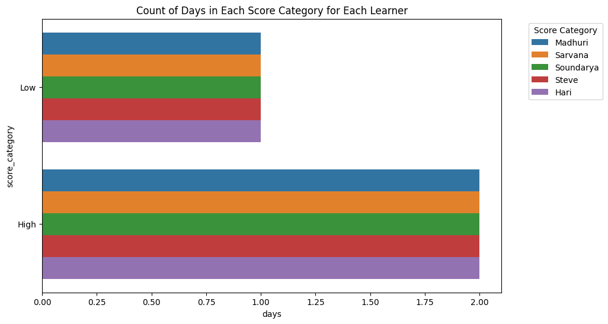

```python
import pandas as pd
import matplotlib.pyplot as plt
import seaborn as sns
```


```python
days_list = [
    1, 1, 1, 1, 1,
    2, 2, 2, 2, 2,
    3, 3, 3, 3, 3
]
```


```python
learners_list = [
    'Madhuri','Sarvana','Soundarya','Steve','Hari',
    'Madhuri','Sarvana','Soundarya','Steve','Hari',
    'Madhuri','Sarvana','Soundarya','Steve','Hari'
]
```


```python
score_list = [
    0, 0, 0, 0, 0,
    535,300,510,580,205,
    880,490,600,625,205
]
```


```python
data = {
    'days':  days_list,
    'learners': learners_list,
    'score' : score_list
}
```


```python
df = pd.DataFrame(data)
```


```python
df_wide = df.pivot(index ='days', columns = 'learners', values = 'score')
```


```python
df_wide = pd.DataFrame(data)
```


```python
def categorize_score(score):
    if score <= 30:
        return "Low"
    elif score <= 50:
        return "Medium"
    else:
        return "High"
```


```python
df_wide['score_category'] = df_wide['score'].apply(categorize_score)
```


```python

```


```python
plt.figure(figsize=(10, 6))
sns.barplot(data = df_wide, x = "days",y = "score_category", hue ="learners",estimator=len)
plt.title("Count of Days in Each Score Category for Each Learner")
plt.legend(title="Score Category", bbox_to_anchor=(1.05, 1), loc='upper left')
```


    <matplotlib.legend.Legend at 0x16385a0c0>


    

    


```python

```


```python

```


---
**Score: 10**
